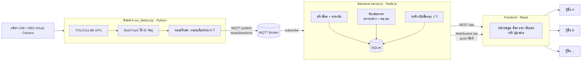
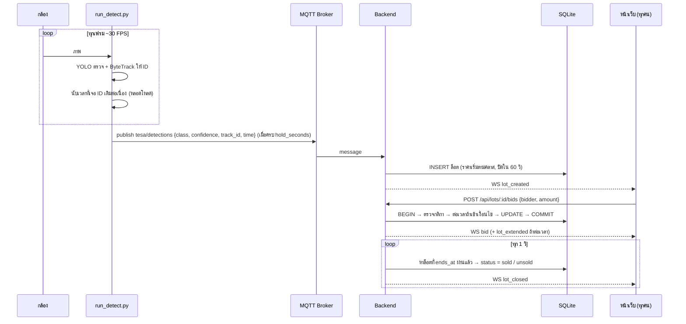
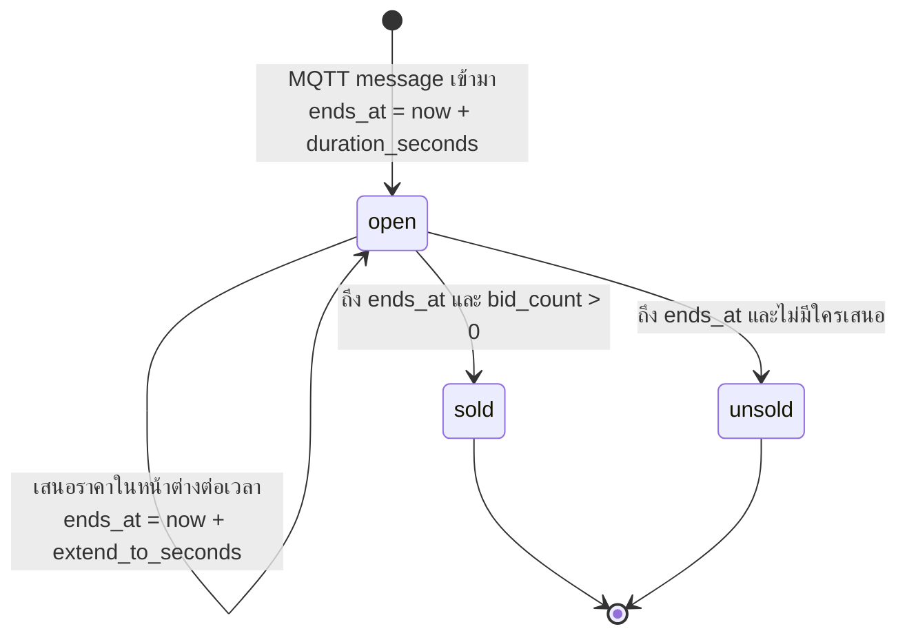

# TESA - ระบบตรวจตำหนิเมล็ดกาแฟด้วย AI และประมูลออนไลน์แบบ real-time

กล้องส่องเมล็ดกาแฟ → AI ตรวจว่าเป็นตำหนิชนิดไหน → ระบบสร้าง "ล็อต" ให้ผู้ซื้อเสนอราคาแข่งกันผ่านหน้าเว็บ → หมดเวลาแล้วปิดการขายอัตโนมัติ

## สารบัญ

1. [ภาพรวมระบบ](#1-ภาพรวมระบบ)
2. [เริ่มใช้งานใน 3 นาที](#2-เริ่มใช้งานใน-3-นาที)
3. [การไหลของข้อมูลตั้งแต่กล้องถึงหน้าเว็บ](#3-การไหลของข้อมูลตั้งแต่กล้องถึงหน้าเว็บ)
4. [ส่วนที่ 1: ตัวตรวจ run_detect.py](#4-ส่วนที่-1-ตัวตรวจ-run_detectpy)
5. [ส่วนที่ 2: Backend (Node.js)](#5-ส่วนที่-2-backend-nodejs)
6. [ส่วนที่ 3: Frontend (React)](#6-ส่วนที่-3-frontend-react)
7. [ไฟล์ config ทั้งหมด](#7-ไฟล์-config-ทั้งหมด)
8. [รูปแบบข้อมูลและ API](#8-รูปแบบข้อมูลและ-api)
9. [การทดสอบ](#9-การทดสอบ)
10. [แก้ปัญหาที่พบบ่อย](#10-แก้ปัญหาที่พบบ่อย)
11. [ข้อจำกัดและแนวทางพัฒนาต่อ](#11-ข้อจำกัดและแนวทางพัฒนาต่อ)
12. [อภิธานศัพท์](#12-อภิธานศัพท์)

---

## 1. ภาพรวมระบบ

ระบบแบ่งเป็น 3 ส่วนที่ทำงานอิสระต่อกัน คุยกันผ่านข้อความมาตรฐาน (MQTT, REST, WebSocket) จึงแก้หรือเปลี่ยนส่วนใดส่วนหนึ่งได้โดยไม่กระทบส่วนอื่น



| ส่วน | โฟลเดอร์ | เทคโนโลยี | พอร์ต | หน้าที่หลัก |
|---|---|---|---|---|
| ตัวตรวจ | `run_detect.py`, `config.yaml` | Python 3.12, ultralytics YOLO11, OpenCV, paho-mqtt | - | ตรวจจับ, ติดตามวัตถุ, นับเวลา, ส่ง MQTT |
| Backend | `backend/` | Node.js 22+, Express, ws, mqtt, node:sqlite | 8000 HTTP+WS (1883 ถ้าใช้ broker ในตัว) | สร้างล็อต, ตัดสินการเสนอราคา, กระจายข้อมูล real-time, เก็บประวัติ, login admin |
| Frontend | `frontend/` | React 19, Vite, TypeScript | 5173 (โหมดพัฒนา) | หน้าประมูล (ทุกคน) และหน้าตั้งค่า (admin login) ธีมสว่าง/มืด มี animation |
| ตัวเปิดระบบ | `start_all.py`, `start.bat` | Python | - | เปิดทั้ง 3 ส่วนด้วยคำสั่งเดียว |

**ทำไมต้องมี broker และ backend ตรงกลาง** เพราะการประมูลต้องมี "ความจริงชุดเดียว" ว่าใครเสนอราคาก่อนและราคาเท่าไร ถ้าปล่อยให้ browser ของผู้ซื้อคุยกันเอง จะเกิดกรณีสองคนกดพร้อมกันแล้วเห็นผลไม่ตรงกัน backend จึงเป็นผู้ตัดสินเพียงคนเดียว และ MQTT ทำให้ตัวตรวจกับ backend ไม่ต้องรู้จักกันโดยตรง (ตัวตรวจอยู่ที่โรงงาน backend อยู่ที่ server ก็ได้)

---

## 2. เริ่มใช้งานใน 3 นาที

**สิ่งที่ต้องมี** Python 3.10+ (พร้อม torch ที่รองรับ CUDA ถ้าจะใช้ GPU), Node.js 22+, กล้อง USB หรือ OBS

```powershell
# ครั้งแรก: ติดตั้งไลบรารี Python (torch ติดตั้งแยกตาม CUDA ของเครื่อง ดู https://pytorch.org)
pip install -r requirements.txt

# ครั้งแรกหลัง clone: สร้าง config.yaml จากแม่แบบ แล้วใส่ host/username/password ของ MQTT broker
# (config.yaml ถูก .gitignore ไว้ เพราะมีรหัสผ่าน จะไม่ถูก commit)
copy config.example.yaml config.yaml

# เปิดทั้งระบบ (ครั้งแรกจะ npm install และ build หน้าเว็บให้อัตโนมัติ)
python start_all.py
```

browser จะเปิด http://localhost:8000 ให้เอง หน้าต่างวิดีโอแสดงภาพจากกล้องพร้อมกรอบตรวจจับ กด Ctrl+C ใน terminal ครั้งเดียวปิดทุกอย่าง

ตัวเลือกที่ใช้บ่อย

```powershell
python start_all.py --sim 5       # ไม่มีกล้อง: ยิงผลตรวจจำลองทุก 5 วิ
python start_all.py --no-detect   # เฉพาะ backend + หน้าเว็บ
python start_all.py --dev         # แก้หน้าเว็บ: เปิด vite dev server ที่ :5173 ด้วย (hot reload)
python start_all.py --build       # บังคับ build หน้าเว็บใหม่
python list_cameras.py            # หาเลข index กล้อง / OBS Virtual Camera
```

เครื่องอื่นในวง LAN (มือถือ, โน้ตบุ๊กเพื่อน) เปิดหน้าเว็บด้วย IP ที่ backend พิมพ์ตอนสตาร์ท เช่น `http://10.10.2.62:8000`

---

## 3. การไหลของข้อมูลตั้งแต่กล้องถึงหน้าเว็บ



จุดสำคัญ

1. **ตัวตรวจไม่ส่งทุกเฟรม** ส่งเฉพาะเมื่อวัตถุตัวเดิมอยู่ในภาพต่อเนื่องครบเวลาที่กำหนด และส่งตัวละครั้ง กันข้อมูลท่วมและกันตรวจผิดชั่วขณะ
2. **1 message MQTT = 1 ล็อต** ถ้าเจอหลายเมล็ดพร้อมกันจะอยู่ในล็อตเดียว ราคาเริ่มคิดจากคลาสที่ความมั่นใจสูงสุด
3. **หน้าเว็บไม่ต้อง refresh** ทุกเหตุการณ์ push ผ่าน WebSocket ถึงทุก browser ภายในเสี้ยววินาที ถ้าหลุดจะ reconnect เองทุก 2 วิ และได้ snapshot ล็อตที่เปิดอยู่ทันทีที่ต่อกลับ

---

## 4. ส่วนที่ 1: ตัวตรวจ run_detect.py

### 4.1 ขั้นตอนต่อเฟรม

```
อ่านเฟรม → model.track() → รายการกรอบ (คลาส, ความมั่นใจ, track_id)
        → TrackHold.update() → progress ต่อ ID, รายชื่อ ID ที่ครบเวลาในเฟรมนี้
        → ส่ง MQTT ถ้ามี ID ครบเวลา → วาดกรอบ ป้าย หลอดโหลด FPS → แสดงผล
```

**โมเดล** `best.pt` คือ YOLO11s ที่เทรนแล้ว 17 คลาสตำหนิเมล็ดกาแฟ: Broken, Cut, Dry_Cherry, Fade, Floater, Full_Black, Full_Sour, Fungus_Damage, Hush, Immature, Parchment, Partial_Black, Partial_Sour, Severe_Insect_Damange, Shell, Slight_Insect_Damage, Withered

**การติดตามวัตถุ (tracking)** ใช้ `model.track()` กับ ByteTrack แทน `predict()` เพื่อให้เมล็ดเดิมได้เลข ID เดิมข้ามเฟรม ป้ายบนจอจะเห็นเป็น `#7 Broken 91%` เลข ID นี้คือหัวใจของการ "ไม่ส่งซ้ำ"

### 4.2 หลอดโหลดและการตัดสินใจส่ง (คลาส TrackHold)

ต่อ ID แต่ละตัว ระบบจำเวลาที่เห็นครั้งแรก เวลาที่เห็นล่าสุด และธงว่าส่งไปแล้วหรือยัง

| เหตุการณ์ | ผล |
|---|---|
| เห็น ID ใหม่ | เริ่มนับเวลา หลอดโหลดว่าง |
| เห็นต่อเนื่องจนครบ `hold_seconds` | หลอดเต็ม → ส่ง MQTT 1 ครั้ง → ตั้งธงส่งแล้ว หลอดเป็นสีเขียว |
| ยังอยู่ในภาพหลังส่งแล้ว | ไม่ส่งซ้ำ |
| หายจากภาพนานเกิน `lost_seconds` | ลบ ID ทิ้ง ถ้ากลับมาใหม่จะนับใหม่และส่งใหม่ได้ |
| หลาย ID ครบเวลาในเฟรมเดียว | รวมส่งใน message เดียว แยกเป็น list |

### 4.3 แหล่งภาพ

ตั้งใน `config.yaml -> source`

- `input: 0` webcam ตัวแรก, `input: 3` กล้องตัวอื่นเช่น OBS Virtual Camera, `input: "video.mp4"` ไฟล์, หรือ `"rtsp://..."`
- `backend: dshow` จำเป็นสำหรับกล้องเสมือนอย่าง OBS (เปิดผ่าน MSMF ไม่ได้) ค่า `auto` จะลอง DirectShow ให้เองถ้าเปิดไม่ติด
- ถ้ากล้องเปิดได้แต่ไม่มีภาพ มักเพราะโปรแกรมอื่น (OBS) ใช้กล้องตัวนั้นอยู่ Windows ไม่ให้เปิดซ้อน ให้รับภาพผ่าน OBS Virtual Camera แทน

### 4.4 GPU และความเร็ว

- ใช้ GPU ตัวแรกอัตโนมัติ ถ้าไม่มี CUDA จะสลับไป CPU พร้อมแจ้งเตือน
- `half: false` เป็นค่าเริ่มต้น เพราะการ์ด GTX 16xx ไม่มี Tensor Core ทำให้ FP16 ช้ากว่า FP32 ราว 4 เท่า (วัดจริง: 83 ms เทียบ 15 ms ต่อเฟรม) เปิด `half: true` เฉพาะการ์ด RTX
- FPS ที่เห็นบนจอถูกจำกัดโดยกล้อง (ทั่วไป 30 FPS) ไม่ใช่โมเดล ถ้าตัวเลขต่ำกว่า 20 ให้ดูหัวข้อแก้ปัญหา

---

## 5. ส่วนที่ 2: Backend (Node.js)

โฟลเดอร์ `backend/` ไฟล์หลัก 4 ตัว

| ไฟล์ | หน้าที่ |
|---|---|
| `server.js` | จุดเริ่ม: HTTP + WebSocket + MQTT subscriber + นาฬิกาปิดล็อต + เสิร์ฟหน้าเว็บ |
| `db.js` | ตาราง SQLite และ logic การเสนอราคาแบบ atomic |
| `mqttConfig.js` | รวมค่า MQTT จาก config.json หรืออ่านจาก config.yaml ของตัวตรวจ |
| `simulate.js` | ยิงผลตรวจจำลองเข้า MQTT สำหรับทดสอบ |

### 5.1 วงจรชีวิตของล็อต



**ราคาเริ่ม** ดูจากคลาสที่ความมั่นใจสูงสุดในล็อต เทียบตาราง `auction.start_price_by_class` ใน config.json (เช่น Parchment 90, Full_Black 30) ถ้าไม่มีในตารางใช้ `default_start_price`

### 5.2 กติกาการเสนอราคา (db.js → placeBid)

ทุกการเสนอราคาทำใน transaction เดียว (`BEGIN IMMEDIATE ... COMMIT`) จึงเป็น atomic: ถ้าสองคนกดพร้อมกันด้วยราคาเท่ากัน คนแรกที่ล็อกฐานข้อมูลได้จะชนะ คนที่สองจะถูกปฏิเสธด้วยข้อความ "ต้องเสนออย่างน้อย ..." ทดสอบยืนยันแล้วใน `e2e.test.mjs`

ลำดับการตรวจ

1. ล็อตมีอยู่และ `status = open`
2. ยังไม่ถึง `ends_at`
3. ราคาต้อง ≥ ราคาเริ่ม (ครั้งแรก) หรือ ≥ ราคาปัจจุบัน + `min_increment` (ครั้งถัดไป)
4. คำนวณต่อเวลา (หัวข้อ 5.3) แล้วอัปเดตราคา ผู้เสนอ จำนวนครั้ง เวลาปิด และบันทึกลงตาราง `bids`

### 5.3 ต่อเวลาอัตโนมัติ (soft close / anti-sniping)

ป้องกันการ "กดวินาทีสุดท้าย" ถ้ามีคนเสนอราคาตอนเหลือเวลาน้อยกว่า `extend_window_seconds` ระบบเลื่อนเวลาปิดเป็น ตอนนี้ + `extend_to_seconds` โดยไม่ทำให้เวลาสั้นลงกว่าเดิม

```
เหลือ 6 วิ  + มีคนเสนอ  → กลับเป็น 10 วิ  (extensions = 1)
เหลือ 3 วิ  + มีคนเสนอ  → กลับเป็น 10 วิ  (extensions = 2)
เหลือ 30 วิ + มีคนเสนอ  → ไม่ต่อ (นอกหน้าต่าง)
ครบ max_extensions       → ไม่ต่อ ปิดตามเวลา
ไม่มีใครเสนอเพิ่ม         → ปิดตามเวลา ไม่ว่าจะเปิดสวิตช์หรือไม่
```

- `max_extensions: 0` = ไม่จำกัดจำนวนครั้ง
- เปิด/ปิดและแก้ตัวเลขได้จากหน้า `#/admin` (ต้อง login) ผ่าน `PUT /api/settings` มีผลกับทุกคนทันที แต่ไม่บันทึกลงไฟล์ รีสตาร์ทแล้วกลับเป็นค่าใน config.json
- เมื่อต่อเวลา backend ส่ง WS `lot_extended` และนับ `extensions` ในล็อต

### 5.4 นาฬิกาปิดล็อต

`setInterval` ทุก 1 วินาที ดึงล็อตที่ `status = open` และ `ends_at <= now` แล้วเปลี่ยนเป็น sold หรือ unsold พร้อม broadcast `lot_closed` การปิดจึงคลาดเคลื่อนได้ไม่เกิน 1 วิ

### 5.5 MQTT broker 2 แบบ

| แบบ | ตั้งค่าใน backend/config.json | ใช้เมื่อ |
|---|---|---|
| broker ภายนอก (ค่าปัจจุบัน) | `embedded_broker: false`, `detector_config: "../config.yaml"` | มี broker บน server อยู่แล้ว backend อ่าน host/port/user/password/topic จาก config.yaml ของตัวตรวจ จึงตั้งค่าที่เดียวและไม่ต้องคัดลอกรหัสผ่านมาไว้สองไฟล์ |
| broker ในตัว (Aedes) | `embedded_broker: true` และตั้ง config.yaml เป็น `host: localhost` | สาธิตเครื่องเดียว ไม่ต้องติดตั้งอะไรเพิ่ม |

### 5.6 ฐานข้อมูล

SQLite ไฟล์ `backend/auction.db` (โหมด WAL) ใช้ `node:sqlite` ที่มากับ Node ไม่ต้อง build native module

```
lots  : id, created_at, device, detected_at, main_class, detections(JSON), start_price,
        current_price, current_bidder, bid_count, ends_at, extensions, status
bids  : id, lot_id, bidder, amount, created_at
```

ลบไฟล์ `auction.db` เพื่อเริ่มใหม่ ตารางจะถูกสร้างอัตโนมัติ (มี migration เพิ่มคอลัมน์ให้ฐานข้อมูลเก่า)

### 5.7 ระบบ login admin (auth.js)

การแก้กติกา (`PUT /api/settings`) ทำได้เฉพาะ admin ส่วนการดูล็อต เสนอราคา และอ่านกติกา ไม่ต้อง login

```
หน้าเว็บ #/admin ──POST /api/admin/login {password}──> backend ตรวจรหัส ──> token (สุ่ม 32 byte, อายุ 12 ชม.)
หน้าเว็บเก็บ token ใน localStorage ──PUT /api/settings + Authorization: Bearer <token>──> ผ่าน requireAdmin
```

- **รหัสผ่าน** อ่านตามลำดับ: ตัวแปรแวดล้อม `ADMIN_PASSWORD` → ไฟล์ `backend/.env` (ไม่ขึ้น git มีแม่แบบ `.env.example`) → `config.json -> admin.default_password` (เฉพาะสาธิต backend จะเตือนใน log และหน้า admin จะขึ้นแถบเหลือง)
- **กัน brute force** ผิดครบ `max_failed_attempts` (5) ล็อก IP นั้น `lock_seconds` (30 วิ) เทียบรหัสด้วย `timingSafeEqual`
- **session** อยู่ในหน่วยความจำของ backend รีสตาร์ทแล้วต้อง login ใหม่ logout ลบ token ทันที
- **ต่อยอด** `auth.js` ออกแบบเป็น session store กลาง อนาคตเพิ่ม role `bidder` (Google / อีเมล OTP) ได้โดยไม่ต้องรื้อ

---

## 6. ส่วนที่ 3: Frontend (React)

โครงไฟล์ใน `frontend/src/`

| ไฟล์ | หน้าที่ |
|---|---|
| `App.tsx` | hash router (`#/` ประมูล, `#/admin` ตั้งค่า), Header, Toast provider |
| `api.ts` | ชนิดข้อมูล, REST, WebSocket, admin login/logout/token |
| `hooks/useAuction.ts` | state กลาง: ล็อต กติกา สถานะเชื่อมต่อ feed เหตุการณ์ และการเสนอราคา |
| `pages/AuctionPage.tsx` | หน้าประมูลสำหรับทุกคน |
| `pages/AdminPage.tsx` | หน้า login admin และแผงตั้งค่ากติกา |
| `components/LotCard.tsx` | การ์ดล็อต, `CountdownRing.tsx` วงแหวนนับถอยหลัง, `Header.tsx` แถบบน + ปุ่มสลับธีม, `Toasts.tsx` แจ้งเตือน |
| `index.css` | design tokens (สี, มุม, easing) ธีมสว่าง/มืด, keyframes |
| `App.css` | สไตล์ทุกส่วน |

### 6.1 หน้าประมูล (`#/`)

| ส่วน | ทำอะไร |
|---|---|
| แถบบน | โลโก้, เมนู ประมูล / Admin, สถานะเชื่อมต่อ (จุดเขียวกระพริบ = สด), ปุ่มสลับธีมสว่าง/มืด |
| Hero | สรุปกติกาปัจจุบัน + ตัวเลข กำลังประมูล / ขายแล้ว / คุณชนะ |
| แถบเครื่องมือ | ช่องชื่อผู้เสนอราคา (จำใน localStorage ของ browser นั้น), แท็บ กำลังประมูล (เรียงใกล้ปิดก่อน) / ปิดแล้ว |
| การ์ดล็อต | คลาสหลัก, **วงแหวนนับถอยหลัง**, ชิปสถานะ/ต่อเวลา, ผลตรวจทุกตัวพร้อมแถบความมั่นใจ, ราคาปัจจุบัน (เด้งเมื่อเปลี่ยน), ผู้เสนอสูงสุด, ช่องราคา + ปุ่มขั้นต่ำ + ปุ่มเสนอ |
| เหตุการณ์ของคุณ | feed ด้านขวา **ของใครของมัน**: แสดงเฉพาะเหตุการณ์ที่เกี่ยวกับชื่อที่ใส่ไว้ เช่น "คุณเสนอ … และเป็นผู้นำอยู่" (เขียว), "คุณถูกแซงโดย …" (แดง), "คุณชนะล็อต …" สลับเป็น "ทั้งหมด" เพื่อดูของทุกคนได้ (จำโหมดใน localStorage) |
| Toast | แจ้งเตือนมุมขวาล่างเมื่อมีล็อตใหม่ ต่อเวลา ปิดล็อต เสนอราคาสำเร็จ/ล้มเหลว และเมื่อคุณถูกแซงหรือชนะ |

**สีวงแหวน** เขียว = ปกติ, เหลือง = อยู่ในหน้าต่างต่อเวลา (เสนอตอนนี้จะต่อ), แดง = ใกล้หมดและต่อไม่ได้แล้ว การ์ดขอบแดงเต้นเมื่อเหลือไม่ถึง 10 วิ กรอบเหลืองพร้อมข้อความ "⏱ ต่อเวลา" เมื่อถูกต่อ ชิป `ต่อเวลา +N/สูงสุด` นับครั้ง

### 6.2 หน้า admin (`#/admin`)

1. ยังไม่ login → การ์ดใส่รหัสผ่าน (มีปุ่มแสดง/ซ่อน, สั่นเมื่อผิด, บอกจำนวนครั้งที่เหลือ, นับถอยหลังตอนถูกล็อก)
2. login แล้ว → แผง **เวลาและราคา** (เวลาประมูลต่อล็อต, ขั้นต่ำเพิ่มราคา) และแผง **ต่อเวลาอัตโนมัติ** (สวิตช์, หน้าต่าง, เวลาที่ต่อ, สูงสุด + ไม่จำกัด, ตัวอย่างผล) แก้แล้วแถบ "บันทึก" เลื่อนขึ้นมาด้านล่าง กดบันทึกจึงมีผลกับทุกคน
3. แผง **ลบข้อมูลประมูลทั้งหมด** (โซนสีแดง) ลบล็อตและประวัติเสนอราคาทุกรายการ แล้วให้ล็อตใหม่เริ่มนับที่ #1 ต้องกดปุ่มแล้วพิมพ์ "ลบ" ยืนยัน (ยกเลิกเองใน 15 วิ) หน้าเว็บทุกคนจะว่างทันทีผ่าน WS `reset` กติกาและรหัสผ่านไม่ถูกลบ
4. token เก็บใน localStorage ของ browser นั้น เข้าหน้านี้ครั้งต่อไปไม่ต้องใส่รหัสจน session หมดอายุ (12 ชม.) หรือกดออกจากระบบ

### 6.3 ธีมและ animation

- ธีมตามระบบเป็นค่าเริ่ม (`color-scheme: light dark`) ปุ่มบนขวาปักธีมตรงข้ามได้ จำใน localStorage และมี inline script ใน `index.html` กัน flash ตอนโหลด
- การ์ดโผล่แบบไล่จังหวะ (stagger) ด้วย `sibling-index()` บน browser ใหม่ และ `--i` จาก React เป็น fallback
- Toast ใช้ `@starting-style` สำหรับ animation ตอนเข้า, ทุก animation ถูกปิดเมื่อผู้ใช้ตั้ง `prefers-reduced-motion`
- พื้นผิวกระจก (`backdrop-filter`) มี fallback เป็นพื้นทึบสำหรับ browser ที่ไม่รองรับ

### 6.4 การอัปเดตข้อมูล

1. โหลดครั้งแรกด้วย REST: `/api/lots` และ `/api/settings`
2. เปิด WebSocket `/ws` รับ `snapshot` + `settings` ทันที จากนั้นรับ event ทีละรายการและอัปเดตเฉพาะการ์ดที่เกี่ยว (upsert ตาม id)
3. เมื่อกดเสนอราคา ส่ง POST แล้วใช้ผลตอบกลับอัปเดตการ์ดทันที browser อื่นได้ผ่าน WS
4. เปลี่ยนกติกาใช้ optimistic update: แสดงบนจอทันที แล้วค่าจริงจาก server ตามมาทับ
5. ทุกตัวเลขกติกา (ขั้นต่ำเพิ่มราคา, เวลาประมูล) ดึงจาก backend ไม่ hardcode ในหน้าเว็บ

### 6.5 โหมดรัน

- **ใช้งานจริง** `npm run build` ได้ `frontend/dist/` แล้ว backend เสิร์ฟให้เองที่พอร์ต 8000 (พอร์ตเดียว เครื่องอื่นเข้าง่าย)
- **พัฒนา** `npm run dev` ที่พอร์ต 5173 พร้อม hot reload โดย `vite.config.ts` proxy `/api` และ `/ws` ไป backend ให้

---

## 7. ไฟล์ config ทั้งหมด

### config.yaml (ตัวตรวจ)

| หมวด | คีย์สำคัญ | ความหมาย |
|---|---|---|
| model | `path`, `device`, `half`, `imgsz`, `conf`, `iou` | ไฟล์โมเดล, GPU index หรือ cpu, FP16, ขนาดภาพเข้าโมเดล, ความมั่นใจต่ำสุดที่จะแสดง, NMS |
| source | `input`, `backend`, `width`, `height` | แหล่งภาพ, DirectShow/MSMF, ขนาดที่ขอจากกล้อง |
| display | `show_fps`, `show_conf`, `resize_to` | การแสดงผลบนหน้าต่างวิดีโอ |
| output | `save_video`, `save_path` | บันทึกวิดีโอผลตรวจ |
| mqtt | `enable`, `host`, `port`, `username`, `password`, `topic`, `device_id` | broker และ topic ที่ส่ง |
| trigger | `hold_seconds`, `lost_seconds`, `tracker`, `bar_height` | เวลาที่ต้องเจอต่อเนื่องก่อนส่ง, เวลาที่ถือว่าหายจากภาพ, bytetrack/botsort |

### backend/config.json

| หมวด | คีย์สำคัญ | ความหมาย |
|---|---|---|
| ราก | `http_port`, `db_file` | พอร์ตเว็บ, ไฟล์ SQLite |
| admin | `password_env`, `default_password`, `session_hours`, `max_failed_attempts`, `lock_seconds` | รหัส admin อ่านจาก env/`.env` ก่อน ค่า default เฉพาะสาธิต, อายุ session, กัน brute force |
| mqtt | `detector_config`, `embedded_broker`, `external_url`, `topic` | แหล่งค่า MQTT (ดู 5.5) |
| auction | `duration_seconds`, `min_increment`, `default_start_price`, `start_price_by_class` | เวลาประมูล, ขั้นต่ำเพิ่ม, ราคาเริ่มต่อคลาส |
| auction.soft_close | `enabled`, `extend_window_seconds`, `extend_to_seconds`, `max_extensions` | ต่อเวลาอัตโนมัติ (ค่าเริ่มต้นตอนสตาร์ท) |

---

## 8. รูปแบบข้อมูลและ API

### MQTT: ตัวตรวจ → backend (topic ตาม config.yaml เช่น `tesa/detections`)

```json
{
  "device": "cam1",
  "time": "2026-09-18T20:25:32.430+07:00",
  "count": 2,
  "detections": [
    {"id": 1, "track_id": 7, "class": "Broken",     "confidence": 0.9123},
    {"id": 2, "track_id": 9, "class": "Full_Black", "confidence": 0.7712}
  ]
}
```

`time` เป็น ISO 8601 พร้อม timezone, `confidence` 0-1, `track_id` ตรงกับเลข # บนจอ

### REST (backend, ทุกอย่างเป็น JSON)

| Method | Path | ใช้ทำอะไร |
|---|---|---|
| GET | `/api/health` | สถานะ, จำนวน client ที่ต่อ WS, broker ที่ใช้ |
| GET | `/api/lots?status=open&limit=100` | รายการล็อต status = open / sold / unsold / ว่าง = ทั้งหมด |
| GET | `/api/lots/:id` | ล็อตเดียวพร้อมประวัติเสนอราคา `bids[]` |
| POST | `/api/lots/:id/bids` | เสนอราคา body `{"bidder":"ชื่อ","amount":60}` ตอบล็อตใหม่ + `extended` |
| GET | `/api/settings` | กติกาปัจจุบัน (ทุกคนอ่านได้) |
| PUT | `/api/settings` | **admin** แก้กติกา body `{"duration_seconds", "min_increment", "soft_close": {...}}` ส่งเฉพาะคีย์ที่จะแก้ |
| POST | `/api/admin/login` | body `{"password"}` → `{"token", "expires_at"}` ผิด = 401 (บอก `attempts_left`) ล็อก = 429 (บอก `retry_after`) |
| POST | `/api/admin/logout` | ยกเลิก token |
| GET | `/api/admin/me` | **admin** ตรวจว่า token ยังใช้ได้ คืน `role`, `expires_at`, `default_password` |
| POST | `/api/admin/reset` | **admin** ลบล็อต + การเสนอราคาทั้งหมด เริ่มเลขล็อตที่ 1 คืน `{lots, bids}` ที่ลบ และ broadcast WS `reset` |
| POST | `/api/lots` | สร้างล็อตด้วยมือเพื่อทดสอบ รับ `duration_seconds` ได้ |

endpoint ที่ระบุ **admin** ต้องส่ง header `Authorization: Bearer <token>` ไม่มีหรือหมดอายุ = 401
ข้อผิดพลาดตอบ `{"error": "ข้อความภาษาไทย", "min": ราคาขั้นต่ำ(ถ้ามี)}` ด้วย HTTP 400/401/404/409/429

### WebSocket `/ws` (backend → ทุก browser)

ทุกข้อความมีรูป `{"type": ..., "data": ..., "ts": เวลา}`

| type | data | เมื่อไร |
|---|---|---|
| `snapshot` | ล็อตที่เปิดอยู่ทั้งหมด | ทันทีที่ต่อ (รวมตอน reconnect) |
| `settings` | กติกาปัจจุบัน | ทันทีที่ต่อ และทุกครั้งที่กติกาเปลี่ยน |
| `lot_created` | ล็อต | ผลตรวจใหม่เข้ามา |
| `bid` | ล็อต (+ field `extended`) | มีคนเสนอราคา |
| `lot_extended` | ล็อต | ต่อเวลาอัตโนมัติ |
| `lot_closed` | ล็อต (status sold/unsold) | หมดเวลา |
| `reset` | `{lots, bids}` จำนวนที่ลบ | admin ลบข้อมูลทั้งหมด หน้าเว็บล้างล็อตและ feed ทันที |

---

## 9. การทดสอบ

```powershell
cd backend
npm start                 # terminal 1
npm test                  # terminal 2: e2e.test.mjs + softclose.test.mjs
```

| ชุดทดสอบ | ครอบคลุม |
|---|---|
| `e2e.test.mjs` | MQTT → สร้างล็อต, ปฏิเสธราคาต่ำ/ไม่มีชื่อ, ราคาสูงกว่าชนะ, 3 คนกดพร้อมกันมีผู้ชนะคนเดียว, WS ได้ event ครบ |
| `admin.test.mjs` | PUT settings ไม่มี token = 401, รหัสผิด = 401, login ถูกได้ token, แก้ duration/min_increment ได้, reset ต้องเป็น admin / ลบหมด / ล็อตถัดไปเป็น #1, logout แล้ว token ใช้ไม่ได้, token ปลอม = 401 |
| `softclose.test.mjs` | login admin แล้วทดสอบ: ต่อเวลาในหน้าต่าง, หยุดเมื่อครบ max, max=0 ไม่จำกัด, ปิดสวิตช์ไม่ต่อ, นอกหน้าต่างไม่ต่อ |

**คำเตือน** `npm test` มีขั้นตอน reset ที่ **ลบล็อตและการเสนอราคาทั้งหมด** ในฐานข้อมูล ห้ามรันกับข้อมูลที่ต้องเก็บ (สำรอง `backend/auction.db` ก่อน หรือชี้ `db_file` ไปไฟล์ทดสอบ)

ทดสอบโดยไม่มีกล้อง: `npm run simulate 5` หรือ `python start_all.py --sim 5`
ทดสอบหน้าเว็บคอมไพล์: `cd frontend; npx tsc -b; npm run build`

---

## 10. แก้ปัญหาที่พบบ่อย

| อาการ | สาเหตุที่พบ | วิธีแก้ |
|---|---|---|
| `เปิดกล้อง index 0 ได้แต่ไม่มีภาพ` หรือ error MSMF -1072875772 | โปรแกรมอื่น (OBS) ใช้กล้องอยู่ | ใช้ OBS Virtual Camera: `input: 3`, `backend: dshow` (หาเลขด้วย `python list_cameras.py`) |
| หน้าต่างวิดีโอเป็นโลโก้ OBS | ยังไม่กด Start Virtual Camera ใน OBS | กดปุ่มที่แผง Controls ของ OBS |
| FPS 10-12 ทั้งที่ใช้ GPU | `half: true` บนการ์ดที่ไม่มี Tensor Core | ตั้ง `half: false` |
| `backend ไม่ตอบที่ http://localhost:8000` | พอร์ตถูกใช้ มี backend เดิมค้าง | ปิด node ที่รัน server.js อยู่ หรือเปลี่ยน `http_port` |
| `[WARN] MQTT ต่อไม่ได้` | broker ไม่ทำงาน / รหัสผิด / firewall | ตรวจ host/port/user/pass ใน config.yaml หรือสลับไป `embedded_broker: true` |
| หน้าเว็บบอก "กำลังเชื่อมต่อ..." ค้าง | backend ปิด หรือเข้าผ่าน IP ที่ไม่ตรง | ดูว่า backend รัน และเปิดด้วย IP ที่ backend พิมพ์ตอนสตาร์ท |
| ตรวจเจอของบนหน้าจอเป็นตำหนิ | Source ใน OBS เป็น Display Capture | เปลี่ยน Source เป็นกล้องหรือวิดีโอ และเพิ่ม `conf` เป็น 0.5 |
| ล็อตเข้ามาถี่เกินไป | `hold_seconds` สั้น หรือ ID กระโดด | เพิ่ม `hold_seconds` / `lost_seconds` หรือลอง `tracker: botsort.yaml` |
| ข้อความไทยใน terminal เป็นตัวอ่านไม่ออก | console ไม่ใช่ UTF-8 | ใช้ `start.bat` (ตั้ง chcp 65001 ให้) หรือรัน `chcp 65001` ก่อน |
| หน้า admin ขึ้นแถบเหลือง "ใช้รหัสผ่านค่าเริ่มต้น" | ยังไม่ได้ตั้ง `ADMIN_PASSWORD` | `copy backend\.env.example backend\.env` แก้รหัส แล้วรีสตาร์ท backend |
| login admin แล้วขึ้น "ลองใหม่ใน N วิ" | ใส่รหัสผิดครบ 5 ครั้ง | รอตามเวลาที่บอก (ค่า `lock_seconds`) |
| กดบันทึกกติกาแล้วเด้งกลับหน้า login | session หมดอายุ (12 ชม.) หรือ backend รีสตาร์ท (session อยู่ในหน่วยความจำ) | login ใหม่ |

---

## 11. ข้อจำกัดและแนวทางพัฒนาต่อ

ต้นแบบนี้ออกแบบสำหรับสาธิตในวง LAN

| ข้อจำกัด | ผลกระทบ | แนวทางเมื่อใช้จริง |
|---|---|---|
| ผู้เสนอราคาไม่มี login (admin มีแล้ว) | ใครก็พิมพ์ชื่อใครได้ | เพิ่ม role `bidder` ใน `auth.js` ด้วย Google Sign-In หรืออีเมล OTP ผูกชื่อกับบัญชี |
| session admin อยู่ในหน่วยความจำ | รีสตาร์ท backend แล้วต้อง login ใหม่ | เก็บ session ลง SQLite หรือใช้ JWT ที่มีลายเซ็น |
| รหัสผ่าน admin เป็น plaintext ใน `.env` | คนที่เข้าถึงเครื่องอ่านได้ | เก็บเป็น hash (argon2/bcrypt) และหมุนรหัสเป็นระยะ |
| ไม่มี HTTPS | ข้อมูลวิ่งเป็น plain text ในเครือข่าย | วาง reverse proxy (nginx/Caddy) พร้อมใบรับรอง |
| ไม่มีชำระเงิน | ปิดล็อตแล้วจบแค่บันทึกผู้ชนะ | เชื่อมผู้ให้บริการชำระเงินภายนอก |
| กติกาที่แก้จากหน้าเว็บไม่ persist | รีสตาร์ทแล้วกลับเป็นค่า config | บันทึกลง SQLite หรือเขียนกลับ config.json |
| SQLite ไฟล์เดียว | เหมาะกับ backend เครื่องเดียว | ย้ายไป PostgreSQL เมื่อต้อง scale หลายเครื่อง |
| ตัวตรวจ ~30 FPS ต่อกล้อง 1 ตัว | หลายกล้องต้องรันหลาย process | ตั้ง `device_id` ต่างกัน backend แยกล็อตตามกล้องได้อยู่แล้ว |

---

## 12. อภิธานศัพท์

| คำ | ความหมาย |
|---|---|
| **YOLO** | โมเดล AI ตรวจจับวัตถุแบบเร็ว ให้กรอบ + คลาส + ความมั่นใจในครั้งเดียว |
| **confidence (ความมั่นใจ)** | ค่า 0-1 ที่โมเดลบอกว่ามั่นใจแค่ไหนว่ากรอบนี้เป็นคลาสนั้น |
| **ByteTrack / track_id** | อัลกอริทึมจับคู่กรอบข้ามเฟรม ทำให้วัตถุเดิมได้เลขประจำตัวเดิม |
| **hold_seconds / หลอดโหลด** | เวลาที่ต้องเจอวัตถุเดิมต่อเนื่องก่อนส่งผล กันการตรวจผิดชั่วขณะ |
| **MQTT** | โปรโตคอลส่งข้อความเบา ๆ แบบ publish/subscribe ผ่านตัวกลางที่เรียกว่า broker |
| **topic** | ชื่อช่องใน MQTT เช่น `tesa/detections` ผู้ส่ง publish และผู้รับ subscribe ที่ชื่อเดียวกัน |
| **REST** | การเรียก API ผ่าน HTTP แบบขอ-ตอบ (GET/POST/PUT) |
| **WebSocket** | ท่อสองทางค้างไว้ระหว่าง browser กับ server ให้ server push ข้อมูลได้ทันทีโดยไม่ต้องขอ |
| **ล็อต (lot)** | หน่วยที่ประมูล 1 ล็อต = ผลตรวจ 1 ครั้ง อาจมีหลายเมล็ด |
| **soft close / anti-sniping** | กติกาต่อเวลาเมื่อมีคนเสนอราคาตอนใกล้หมด กันการกดวินาทีสุดท้าย |
| **min_increment** | จำนวนเงินขั้นต่ำที่ต้องเสนอสูงกว่าราคาปัจจุบัน |
| **atomic / transaction** | การอ่าน-ตรวจ-เขียนที่ทำเป็นก้อนเดียว ไม่มีใครแทรกกลางได้ ใช้ตัดสินคนที่กดพร้อมกัน |
| **FP16 / half** | คำนวณด้วยทศนิยม 16 บิต เร็วขึ้นบนการ์ดที่มี Tensor Core แต่ช้าลงบนการ์ดที่ไม่มี |
| **OBS Virtual Camera** | กล้องเสมือนที่ OBS สร้างขึ้น ให้โปรแกรมอื่นรับภาพฉากของ OBS เหมือนเป็น webcam |
